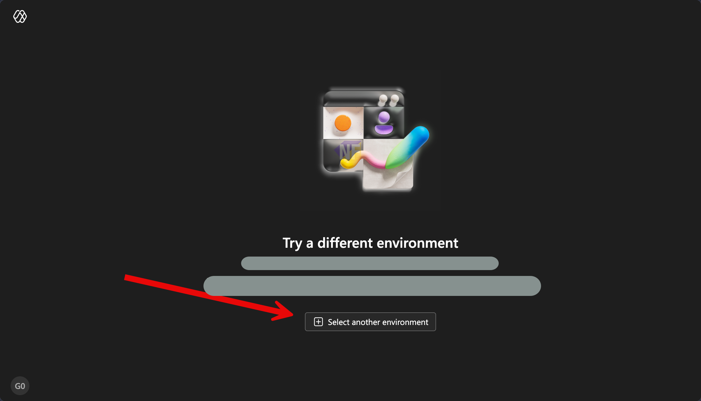
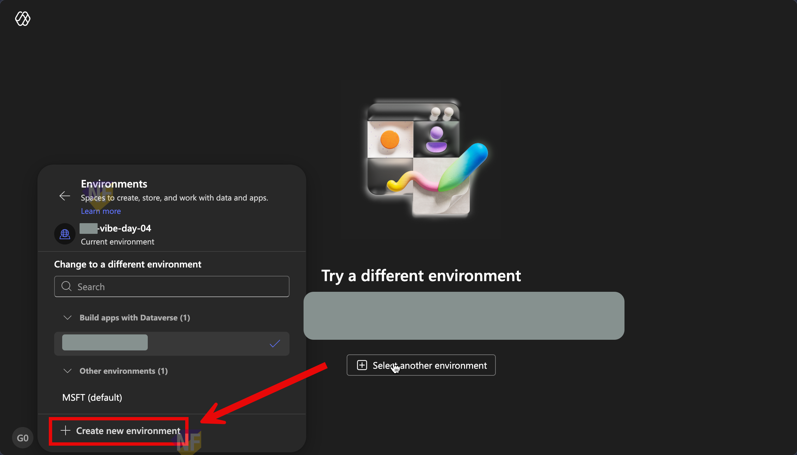
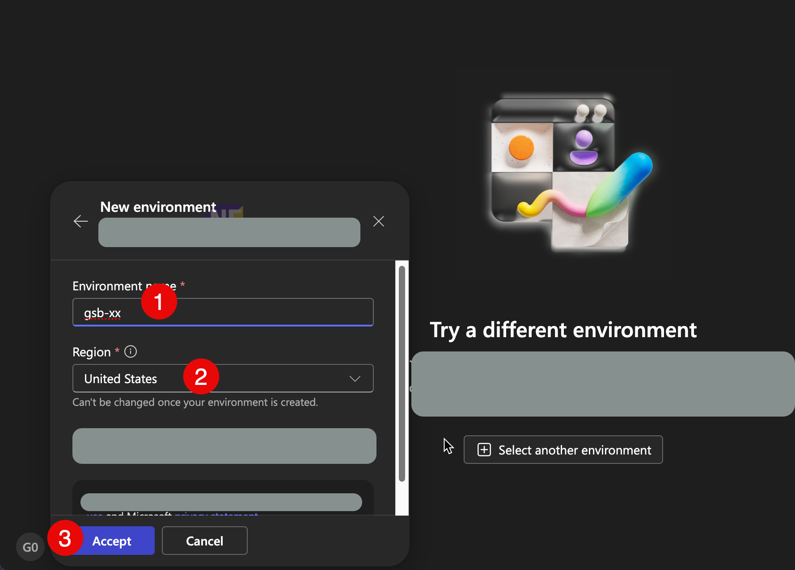

# แบบฝึกหัดที่ 1: แก้ปัญหา Try a different environment

แบบฝึกหัดนี้ช่วยผู้เรียนแก้ปัญหาเมื่อเข้า Power Apps Vibe แล้วเจอข้อความ "Try a different environment" โดยจะสร้าง Developer environment ใหม่ที่รองรับเงื่อนไขของประสบการณ์นี้

## Exercise

สร้าง environment ใหม่ในหน้า Power Apps Vibe ให้สำเร็จ และกลับมาใช้งานได้ตามปกติ

## Scenario

ผู้เรียนลงชื่อเข้าใช้ที่ [Power Apps Vibe](https://vibe.powerapps.com) แล้วพบข้อความว่า environment ปัจจุบันไม่รองรับ โดยหน้าจอแนะนำให้เลือก environment อื่น

## Practice 1: เริ่มจากหน้าจอแจ้งเตือนและเปิดเมนูเปลี่ยน environment

1. ไปที่หน้า [Power Apps Vibe](https://vibe.powerapps.com) และลงชื่อเข้าใช้ด้วยบัญชีที่ใช้เรียน
2. เมื่อเห็นข้อความ "Try a different environment" ให้กดปุ่ม **Select another environment** ที่อยู่กลางหน้าจอ

    
จุดตรวจสอบ:
- ต้องเห็นปุ่ม **Select another environment** และสามารถเปิดแผงเลือก environment ได้

## Practice 2: สร้าง Developer environment ใหม่

1. ในแผง **Environments** ให้กด **Create new environment**
    
2. ใส่ชื่อ environment ด้วยรูปแบบ:

   ```text
   gsb-[xx]
   ```

3. ในช่อง **Region** ให้เลือก **United States**
4. กด **Accept**

    

จุดตรวจสอบ:
- ชื่อ environment เริ่มต้นด้วย gsb-
- Region เป็น United States ก่อนกด Accept

## Practice 3: รอให้ระบบสร้างเสร็จและยืนยันผล

1. รอจนระบบสร้าง environment เสร็จสมบูรณ์
2. กลับมาที่หน้า Power Apps Vibe และยืนยันว่าไม่แสดงข้อความ "Try a different environment" อีก
3. [เริ่มใช้งานขั้นตอนถัดไปของแล็บได้](https://teerasej.github.io/power-app-vibe-coding-exercise)

จุดตรวจสอบ:
- เห็น environment ใหม่ในรายการ
- เข้าใช้งาน Power Apps Vibe ได้โดยไม่ติดหน้าจอแจ้งเตือนเดิม

## สรุป

เมื่อทำครบทุกขั้นตอน พวกเราจะมี Developer environment ใหม่ที่รองรับ Power Apps Vibe และ[พร้อมสำหรับแบบฝึกหัดถัดไป](https://teerasej.github.io/power-app-vibe-coding-exercise)
